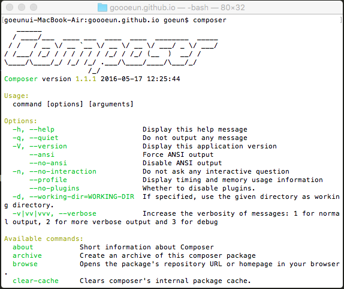

## Composer(패키지 간 의존성 관리자)

Composer는 PHP에서 패키지 간 의존성 관리를 해주는 의존성 관리자 역할을 한다.
라이브러리/패키지 관리를 Composer가 대신 해줌으로써 우리는 쉽게 패키지를 관리할 수 있고 베포할 수 있다.

Composer는 PHP 5.3.2+ 이상에서 구동된다.

### Composer 설치 (OS X)

Composer을 설치하는 방법에는 Locally와 Globally 2가지가 있다. 
Locally는 원하는 프로젝트 안에서만 사용할 수 있도록 설치하는 방법이고, 
Globally는 모든 프로젝트에서 Composer를 사용할 수 있도록 설치하는 방법이다.

#### 1.Locally
```bash
curl -sS https://getcompos`er.org/installer | PHP
```

* 설치시 오류가 발생한다면(권한 관련 오류일 경우) 맨 앞과 PHP 앞부분에 sudo를 붙여주면 해결된다.

#### 2.Globally
```bash
curl -sS https://getcomposer.org/installer | PHP
mv composer.phar /usr/local/bin/composer
```

 설치 후 composer를 입력했을 때 해당화면이 나오면 설치가 완료된 것이다.

 


### Packagist

Packgist는 Composer에서 제공하는 패키지 리스트이다. 
많이 쓰이는 Markdown 패키지를 사용해보자!

#### 1.https://packagist.org/packages/dflydev/markdown에서 최신 버전의 markdown을 설치한다.

#### 2.개발중인 프로젝트의 최상위 directory에 composer.json 파일을 생성한다.

#### 3.composer.json에 아래의 코드를 복사, 붙여넣기 한다.
```json
{
  	"require" : {
  		"dflydev/markdown" : "1.0.3"
  	}
}
```
* json 형식에 맞추어 "패키지 이름" : "버전" 순으로 작성해준다

#### 4.composer.json이 있는 directory에서 해당 명령어를 입력한다.
```bash
composer install
```

* vendor라는 폴더가 생성되고 composer.json에 적어준 패키지가 vendor 폴더에 설치된다.

#### 5.PHP 파일에서 사용하는 예제
```php
<?php
	require 'vendor/autoload.php';
	use dflydev\markdown\MarkdownParser;
	$markdownParser = new MarkdownParser();
	echo $markdownParser->transformMarkdown("#Hello World");
?>
```

* require에서 사용하는 패키지를 하나하나 쓸 필요 없이 autoload해주면 알아서 패키지를 가져와준다.


### 참고
> http://www.opentutorials.org/course/62/5221 생활코딩
